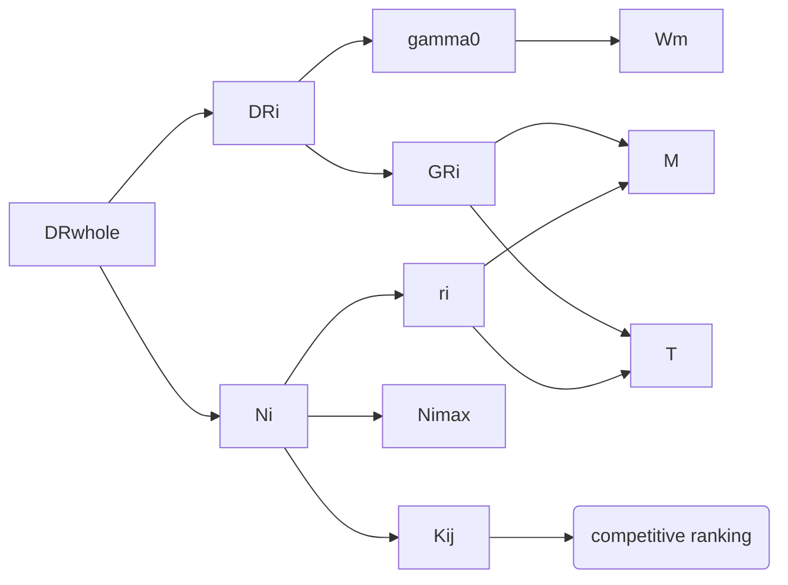

# Introduction

## Background✅

Fig1 真菌图（手绘，淘宝）

Fig2 真菌在碳循环中作用图（电脑制作，自己做）

## Restatement of the problem✅

Finish

## Our work

### DRF model✅

### DRFD model (Decompositon rate of fungal communities considering diversity)❓

Fig3 流程图（电脑制作，自己做）2人，手绘+电脑

# Assumptions❓

# Notations✅❓

## Notations

Table 1 Notations

# DRF model

导入：

- 把DRwhole分解为DRi Ni
- 仅考虑温度和湿度以及种类建立basic model
- 考虑interaction 建立DRFI model
- 对xxx进行改变，分析模型的特性
- 将模型应用在xxxx的环境中

Fig 4❓

## Basic model

### 介绍$\sum DR_iN_i$

### 介绍$N_i$

$\dot{N}_i = r_iN_i(1-\frac{N_i}{N_{i\max}})$

$r_i = r_0(2\pi\sigma_M\sigma_T\sqrt{1-\rho^2})^{-1}\exp[\frac{1}{2\pi\sigma_M\sigma_T\sqrt{(1-\rho^2)}}(\frac{(M-M_0)^2}{\sigma_M^2}+\frac{(T-T_0)^2}{\sigma_T^2}-\frac{2\rho(M-M_0)(T-T_0)}{\sigma_T\sigma_M})]$

$N_{i\max}$ 只与环境资源有关

### 介绍$DR_i = f(MW_i,GR_{i})$

$i:(f,W_{mi})$

$DR_i = GR_i/\gamma_{s}$

$\gamma_s\propto\frac{1}{W_m}$

拟合

已有$GR_i=f_{i}(M,T)$

$GR_i = c_{i1}(T-T_{min})(1-exp[c_{i2}(T-T_{max})])\times(M^2+c_{i3}M+c_{i4})$

$W_m \uparrow,GR_i\downarrow$

## mt 默认 mw

## Take interactions between fungal communities into consideration

介绍一下交互的内容；（查资料，有什么交互？促进还是竞争？描述交互影响了哪些特性？）

因此，对于我们的模型$\sum DR_iN_i$，把交互归结于$N_i$中

### 介绍$N_i$

$\dot{N}_i = r_iN_i(1-\frac{N_i}{N_{i\max}}+\sum_{j\neq i}{k_{ij}\frac{N_j}{N_{j\,max}}})$

$r_i = r_0(2\pi\sigma_M\sigma_T\sqrt{1-\rho^2})^{-1}\exp[\frac{1}{2\pi\sigma_M\sigma_T\sqrt{(1-\rho^2)}}(\frac{(M-M_0)^2}{\sigma_M^2}+\frac{(T-T_0)^2}{\sigma_T^2}-\frac{2\rho(M-M_0)(T-T_0)}{\sigma_T\sigma_M})]$

其中$k_{ij}$可以视为与competitive ranking正相关

Ranking

N   DR

MT 

## General analysis of model

5.1 short term,long term

5.2

5.3

## Implenentation of model 

# DRFD model

# Sensitivity Analysis

# Strength & Weakness

# Conclusion

# 2 pages

# References

DRF Model

Strength Weakness

Conclusion

Reference

DRF Model In 

程序

Sensitivity analysis

程序

